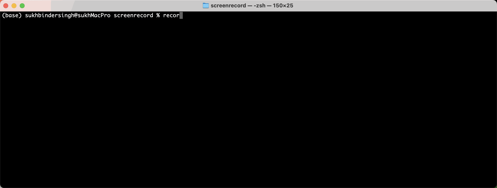

# screenrecord

[](https://pypi.org/project/screenrecord/)
[](https://github.com/sukhbinder/screenrecord/releases)
[](https://github.com/sukhbinder/screenrecord/actions/workflows/test.yml)
[](https://github.com/sukhbinder/screenrecord/blob/master/LICENSE)

Record screen with python

## Installation

Install this tool using `pip`:
```bash
pip install screenrecord
```
## Usage

For help, run:
```bash
record --help
```
You can also use:
```bash
python -m record --help
```



## Development

To contribute to this tool, first checkout the code. Then create a new virtual environment:
```bash
cd screenrecord
python -m venv venv
source venv/bin/activate
```
Now install the dependencies and test dependencies:
```bash
pip install -e '.[test]'
```
To run the tests:
```bash
python -m pytest
```
